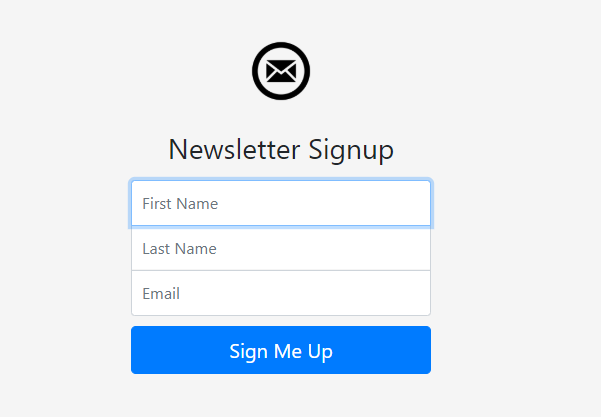

# Newsletter - Signup
-----------------------------------------------------------
* We have all come across e-Newsletter invitations in any website or product we have invested our time into. This is a simple demonstration of creating a Signup page for your own Newsletter. Express Node server has been used to accomplish the task.

* This project includes a `Procfile` so that you can clone it and host it on the internet using Heroku. The deployment of my project is at https://pacific-crag-69244.herokuapp.com/ . The Signup details are stored in servers owned by Mailchimp and the Mailchimp API has been used for the same. https://mailchimp.com/developer/guides/get-started-with-mailchimp-api-3/

* This is a re-implementation of the same project that is given in the Udemy Course `The Complete 2020 Web Development Bootcamp` by `Angela Yu` on Udemy. I recommend this course to anyone interested in Web Development. She is my best teacher ever and the course is almost the perfect Full-Stack Development course out there.

* Node Modules used :
```
         > Express
         > HTTPS
         > body-parser
```
------------------------------------------------------------

### Running the Server



* Create an account at https://mailchimp.com/  and generate an API key and a list ID. These are required for authentication while making a POST request to the Mailchimp servers.

* Open app.js in a code editor. Enter your API key after `xyz:` for the `auth` parameter in options object. Modify the url variable by adding your field ID at the end after `/`. And replace the `X` in the URL with number that is present at the end of your API key.

* Open terminal and navigate to the project directory. Type `node app.js` to start the server. Go to your browser and search `localhost:3000` to view the signup page.

* Alternately you can deploy the server using Heroku and browse to the link generated to view the Signup page. Any details entered will be stored in your subscription lists under your Mailchimp account.
